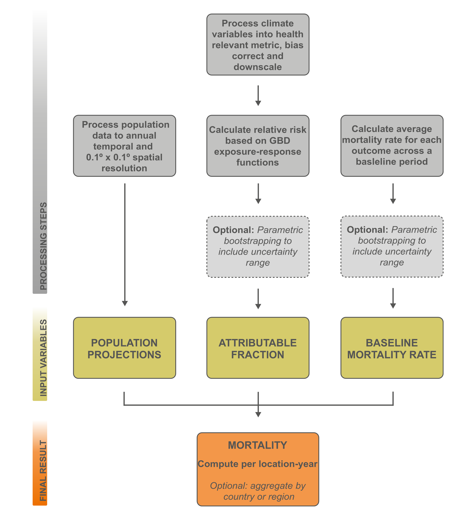

# An Open-Access Workflow Combining Climate Model Projections with Epidemiological Frameworks to Assess Air Quality Mortality

> A reproducible workflow to calculate excess mortality due to changes in surface ozone and PM2.5.

This repository contains the workflow presented in **[An Open-Access Workflow Combining Climate Model Projections with Epidemiological Frameworks to Assess Air Quality Mortality](https://doi.org/10.22541/essoar.177170388.88002537/v1)**. The aim is to allow users to apply the workflow directly to address specific research questions, modify individual components (for example, exposure metrics, epidemiological inputs, or scenarios) to suit their study design, or extend it to related applications. It can also be used as a tutorial to understand the framework using an [example dataset](https://doi.org/10.5281/zenodo.18436835), reproducing the results and figures in the paper. 

**A. F. Wells**, J. W. Hurrell, E. Gilleland, & G. B. Anderson (2026).  
An Open-Access Workflow Combining Climate Model Projections with Epidemiological Frameworks
to Assess Air Quality Mortality.
ESS Open Archive. 21 February 2026. <https://doi.org/10.22541/essoar.177170388.88002537/v1>

## Abstract

Surface-level air pollution is a major contributor to human mortality worldwide, and future climate change is expected to alter concentrations of pollutants such as ozone and particulate matter. Estimating the health burden of these changes requires combining climate model projections with epidemiological frameworks, such as those developed in the Global Burden of Disease (GBD) study. However, significant barriers hinder this integration. Climate model outputs differ from health metrics in spatial resolution, temporal aggregation, and pollutant definitions. For example, GBD quantifies ozone exposure as the highest seasonal average of 8-hour daily maximum concentrations, while most climate models provide hourly or monthly mean data. Furthermore, model outputs often require bias correction and spatial downscaling to align with exposure-response functions derived from observational data.

We present an open-access workflow designed to bridge this gap, enabling researchers to process climate model data for health impact assessments of air quality. The workflow processes climate model pollutant data to align with GBD metrics, applies bias correction and downscaling methods, and calculates mortality using established GBD exposure-response functions and baseline demographic data. This approach allows consistent, reproducible estimation of future health impacts across scenarios and models. By making the workflow publicly available, we aim to lower barriers for interdisciplinary research and support collaboration between climate scientists and epidemiologists. This work provides a foundation for quantifying the health implications of changing air quality under future climate conditions, improving decision-making around mitigation and adaptation strategies.

## Data availability

The data required to run an example of this workflow and reproduce the figures are hosted externally:

Wells, A. F., Anderson, G. B., Hurrell, J. W., & Gilleland, E. (2026). Air Quality Mortality Workflow: Input Datasets (v1.0.0) [Data set]. Zenodo. <https://doi.org/10.5281/zenodo.18436835>

The data directory structure is assumed by the scripts and should be preserved after download.

## Running the workflow and reproducing the paper figures

The workflow is designed to be run with three parallel tracks, reflecting the description in the paper and the figure below.

One could start with `population` processing, then `bmr` and finally processing the climate variables in `ozone` and `pm25`. Then the `mortality` directory is ready to execute for each variable.

Each script is intended to be runnable independently once its inputs exist.

Figures 2 and 3 in the paper can be reproduced by running the scripts in `/plotting/mortality/`

## Citation

If you use this workflow, please cite:

> **A. F. Wells**, J. W. Hurrell, E. Gilleland, & G. B. Anderson (2026). An Open-Access Workflow Combining Climate Model Projections with Epidemiological Frameworks
to Assess Air Quality Mortality. ESS Open Archive. 21 February 2026. <https://doi.org/10.22541/essoar.177170388.88002537/v1>

A BibTeX entry will be added once the paper is published.

## Contact

For questions or issues related to the workflow, please contact:

* **Author**: Alice F. Wells
* **Affiliation**: Colorado State University
* **Email**: awells96@rams.colostate.edu

## 📝 License

This repository is released under the **MIT** license. See `LICENSE` for details.
